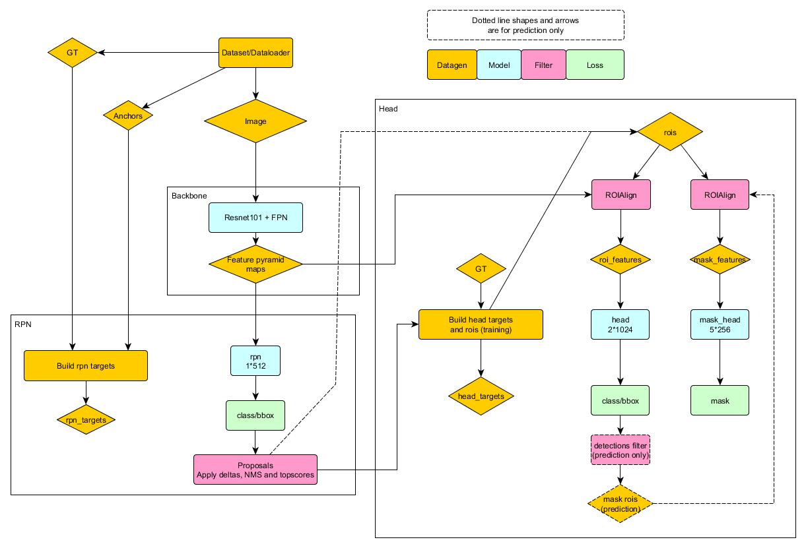

# Pytorch MaskRCNN

This is a Pytorch/Fastai implementation of MaskRCNN based on previous versions by Matterport and MultiModal Learning (see acknowledgements at bottom of page). This was mainly a personal learning exercise but the simplified structure may help others wanting to understand maskrcnn.

Includes:

* Overview diagram that shows the key components of maskRCNN
* Code cleaned up and structured as per the diagram to make it easy to understand and experiment with each part.
* Works with pytorch v1 and fastai v1
* Training and prediction working on nuke data from 2018 kaggle bowl; training and prediction on synthetic
 shapes data; and prediction on images using coco categories. 

Todo:

* More tests. How can it best be tested?
* Could the experimental test framework be useful for continuous testing? Is there a good framework already written?
* How to expand testing to keras.  i.e. how to adapt matterport for eager mode?

## Structure

Note that training and prediction follow slightly different paths.

The core code reflects the diagram:
* datagen - anchors, dataset, head_targets, rpn_targets
* model - maskrcnn (whole thing), resnet (backbone), resnetFPN (feature pyramid), rpn
* filter - proposals, roialign, detections
* loss - loss functions for rpn and head

Utilities
* lib - c extensions for nms and roialign
* utils - box_utils, image_utils, visualize, batch (function decorator to process batches)
* callbacks - to tailor fastai for maskrcnn
* ipstartup - startup script for notebooks
* config - configuration constants

Samples
 * Applications typically with dataset, config, learner, notebooks

Test (experimental)
* baseline - classes to help compare a new versus baseline version
* test_*.py
    - limited number of pytest functions versus multimodal
    - tried versus matterport but original needs adapting to work with eager mode
* tests.ipynb - notebook to run pytests

## Installation

1. Clone this repository.

        git clone https://github.com/simonm3/maskmm.git

2. Download pretrained coco weights from [Google Drive](https://drive.google.com/open?id=1LXUgC2IZUYNEoXr05tdqyKFZY0pZyPDc).
        
3. Build the nms and roialign binaries:
        
        cd maskmm/maskmm/lib
        ./make.sh
    
4. Install the python package and dependencies in edit mode

        cd maskr
        pip install -e .

## Acknowledgements and links

### Blogs
These are useful introductions to image segmentation and maskrcnn

[A Brief History of CNNs in Image Segmentation: From R-CNN to Mask R-CNN](https://blog.athelas.com/a-brief-history-of-cnns-in-image-segmentation-from-r-cnn-to-mask-r-cnn-34ea83205de4) 

[Deep Learning for Instance-level Object Understanding. Tutorial	on	Deep	Learning for Objects and Scenes (by Ross Girshick)](http://deeplearning.csail.mit.edu/instance_ross.pdf). 

[Object Detection using Deep Learning for advanced users](https://medium.com/ilenze-com/object-detection-using-deep-learning-for-advanced-users-part-1-183bbbb08b19) 

[Faster R-CNN: Down the rabbit hole of modern object detection](https://tryolabs.com/blog/2018/01/18/faster-r-cnn-down-the-rabbit-hole-of-modern-object-detection/) 

[Region of Interest Pooling explained](https://deepsense.ai/region-of-interest-pooling-explained/) 

### Papers

These are the main papers that led to maskrcnn:

[FastRCNN](https://arxiv.org/pdf/1504.08083.pdf)

[FasterRCNN](https://arxiv.org/pdf/1506.01497v3.pdf)

[MaskRCNN](https://arxiv.org/abs/1703.06870)

[Feature Pyramid Networks](https://arxiv.org/abs/1612.03144)

### Packages

This package was based on the multimodal package which was based on matterport.

[Matterport Mask_RCNN](https://github.com/matterport/Mask_RCNN). A keras/tensorflow implementation of maskrcnn

[Multimodal learning](https://github.com/multimodallearning/pytorch-mask-rcnn). Pytorch version of matterport.

[Facebook detectron](https://github.com/facebookresearch/Detectron). Facebook super package that includes implementation of a wide range of image segmentation algorithms using Caffe2.

[Pytorch detectron](https://github.com/roytseng-tw/Detectron.pytorch). Conversion of detectron to pytorch.

